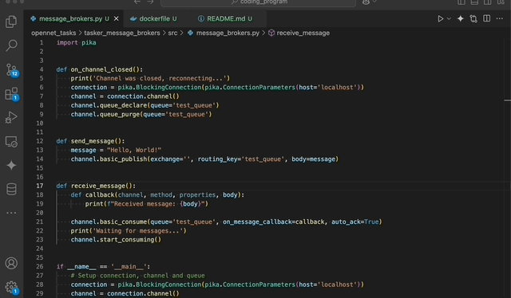

# How to run it

### using Python
make sure you have install RabbitMQ and start the server, if not, please check how on [RabbitMQ website](https://www.rabbitmq.com/docs/download).

```
pip install -r requirements.txt
python /src/tasker_message_brokers.py
python /src/test.py # send message to rabbitmq
```

### using Docker

```
docker-compose build
docker-compose up
python /src/test.py # send message to rabbitmq
```

# Structure of directory

```
.
├── README.md
├── docker-compose.yaml
├── dockerfile
├── requirements.txt
├── src
│   ├── message_brokers.py
│   └── tester.py
└── static
    └── tasker_message_brokers.gif
```

src: including the main source code of python file.
static: to save the static file as gif, picture, html and else.

# Requirements.txt
pika==1.3.2

# Gif of demonstration



# Dockerfile

```
FROM python:3.11-alpine
WORKDIR /tasker_message_brokers
COPY requirements.txt requirements.txt
RUN pip install -r requirements.txt -v --no-cache-dir
COPY . .
ENV RABBITMQ_HOST=rabbitmq
CMD ["python", "src/message_brokers.py"]
```

# Docker-compose yaml
```
version: '3.8'

services:
  rabbitmq:
    image: rabbitmq:3-management
    ports:
      - "5672:5672"
      - "15672:15672"
    networks:
      - my-network

  python-app:
    build: .
    depends_on:
      - rabbitmq
    environment:
      RABBITMQ_HOST: rabbitmq
    networks:
      - my-network
networks:
  my-network:
```
